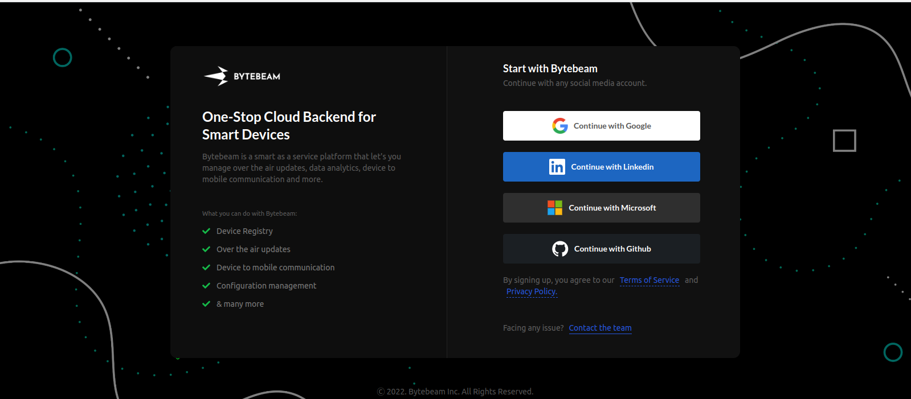
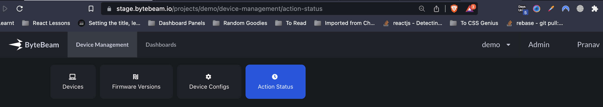
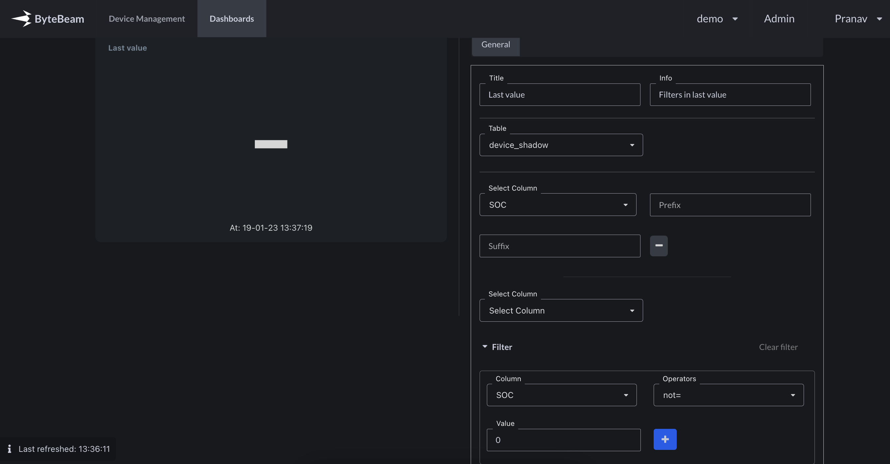

## Support for Microsoft login

You can now login to Bytebeam with your microsoft account

## Aggregate values panel now supports adding multiple aggregates

This will now allow you to see min/max/avg of a metric in a single widget

## You can now sort actions to show incomplete actions first

Bytebeam only pushes actions to devices if there is no other pending action. An annoyance with this was that if there was an action that was triggered long ago and has not yet completed it was hard to find that action out. With this change you can now see the incomplete actions at the top of the page.

## You can now access multiple projects in the same browser

Earlier you could only access one project at once. If you had two tabs open and switched to a different project in one of them, the other would also be automatically switched to the new project. This was happenign as project information was stored in shared local storage between tabs. We've moved the project information to the URL. Another side effect of this is that it also makes sharing dashboard URLs easlier.

## Last value panel now supports filters

You can now filter out rows being considered in last value panel. Similar support for other panels will be rolled out in upcoming releases.

## Bug fixes & Minor changes

- UI elements were realigned and resized to be symmetrical in edit panel widgets
- Emails are now stored in lowercase in the database to prevent login errors when emails are manually added in a different case.
- Added appropriate response to handle 404 errors in the backend
